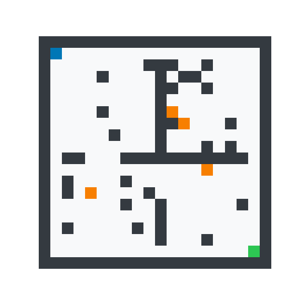

# 🤖 AI-Based Autonomous Navigation System


> A fully simulated autonomous navigation system featuring A\*, Dijkstra, and BFS path planning algorithms with LiDAR perception, dynamic obstacle avoidance, and real-time re-planning — all in a custom 2D grid-world simulation. No hardware required.

---

## Demo



---

## Problem Statement

Autonomous agents — robots, drones, delivery vehicles — must navigate unknown environments while avoiding static and moving obstacles in real time. This project simulates the core software stack:

| Challenge | This Project's Solution |
|-----------|------------------------|
| Unknown obstacles | LiDAR + camera perception (8-direction scan) |
| Moving obstacles | Dynamic obstacle re-planning every 8 steps |
| Optimal routing | A* with Manhattan heuristic |
| Collision avoidance | Proximity sensor + reactive greedy fallback |
| Algorithm selection | A* vs Dijkstra vs BFS comparative analysis |

---

## Industry Relevance

| Industry | Application |
|----------|-------------|
| Autonomous Vehicles | Waymo, Tesla, Cruise — global route planning |
| Warehouse Robots | Amazon Robotics, Locus — multi-agent A* coordination |
| Drone Delivery | Amazon Prime Air, Zipline — 3D path planning |
| Industrial Safety | ABB, KUKA — collision-free robot arm planning |
| Smart Cities | Last-mile delivery robots, pedestrian-aware navigation |

---

## Architecture

```
Environment (Grid World)
        │
        ▼
  Perception System
  ┌─────┬──────┬──────────┐
  │LiDAR│Camera│ Proximity│
  └──┬──┴──────┴────┬─────┘
     │              │
     ▼              ▼
  Object Detector   ──→  Path Planner (A* / Dijkstra / BFS)
                                │
                                ▼
                    Navigation Controller
                    (follow plan / replan / avoid)
                                │
                                ▼
                    Environment (execute move)
                                │
                                ▼
                    Visualiser (charts + GIF)
```

See `docs/architecture.md` for the full system diagram.

---

## Tech Stack

| Layer | Technology |
|-------|-----------|
| Language | Python 3.10+ |
| Simulation | Custom 2D grid world (NumPy) |
| Path Planning | A*, Dijkstra, BFS (pure Python) |
| Perception | Simulated LiDAR, camera, proximity sensor |
| Visualisation | Matplotlib, Pillow |

---

## Project Structure

```
ai-autonomous-navigation/
├── simulation/
│   ├── __init__.py
│   └── environment.py      ← 2D grid world + dynamic obstacles
├── src/
│   ├── __init__.py
│   ├── perception.py       ← LiDAR, camera, object detector
│   ├── path_planning.py    ← A*, Dijkstra, BFS
│   ├── navigation.py       ← decision controller + re-planning
│   └── visualizer.py       ← all charts + GIF animation
├── outputs/
│   ├── images/             ← 7 PNG charts + animation GIF
│   └── videos/
├── docs/
│   └── architecture.md
├── notebooks/
│   └── demo.ipynb
├── main.py                 ← run everything
├── requirements.txt
└── .gitignore
```

---

## Installation

```bash
# 1. Clone repo
git clone https://github.com/YOUR_USERNAME/ai-autonomous-navigation.git
cd ai-autonomous-navigation

# 2. Create virtual environment
python -m venv venv

# 3. Activate
# Windows:
venv\Scripts\activate
# Mac/Linux:
source venv/bin/activate

# 4. Install dependencies
pip install -r requirements.txt
```

---

## Usage

```bash
# Default: A* navigation, 20×20 grid, with animation
python main.py

# Choose algorithm
python main.py --algo dijkstra
python main.py --algo bfs

# Compare all 3 algorithms
python main.py --compare

# Larger grid
python main.py --grid 30

# Skip animation (faster)
python main.py --no-anim
```

---

## Results

| Algorithm | Nodes Explored | Path Length | Steps to Goal |
|-----------|---------------|-------------|---------------|
| **A\*** | 249 | 35 | **28** |
| Dijkstra | 271 | 35 | 28 |
| BFS | 271 | 35 | 28 |

**A\* explores 8% fewer nodes than Dijkstra** on the same map, confirming the heuristic advantage.

---

## Output Charts

| File | Description |
|------|-------------|
| `environment_map.png` | Initial grid with all obstacles |
| `planned_path.png` | Computed route overlaid on grid |
| `navigation_result.png` | Final trail — success/failure |
| `lidar_scan.png` | Polar LiDAR sensor reading |
| `algorithm_comparison.png` | A* vs Dijkstra vs BFS bar chart |
| `decision_log.png` | Decision type breakdown over time |
| `navigation_animation.gif` | Full run replay |

---

## Simulation Modules

### Perception
- **LiDAR**: 8-direction ray casting, configurable range (default 8 cells)
- **Camera**: 7×7 forward-facing patch showing local environment
- **Object Detector**: classifies OBSTACLE / DYNAMIC / GOAL / FREE from camera patch
- **Proximity**: 8-direction boolean collision check for emergency avoidance

### Path Planning
- **A\***: heuristic search with Manhattan distance, optimal and efficient
- **Dijkstra**: uniform-cost, no heuristic — explores more nodes but still optimal
- **BFS**: unweighted breadth-first — optimal by hop count

### Navigation Controller
Decision hierarchy at each step:
1. Goal reached? → stop
2. Emergency (box-in detected)? → reactive avoid
3. Planned next step free? → follow plan
4. Next step blocked? → re-plan immediately
5. No plan? → greedy closest-to-goal move

---

## Future Improvements

- [ ] ROS 2 integration for real robot deployment
- [ ] CARLA simulator integration for autonomous vehicles
- [ ] YOLO object detection on real camera frames
- [ ] Reinforcement Learning (PPO/DQN) policy instead of A*
- [ ] SLAM (Simultaneous Localisation and Mapping)
- [ ] Multi-agent coordination (multiple robots, no collision)
- [ ] 3D environment (drone navigation)
- [ ] Real-time web dashboard (Flask/Streamlit)

---

## Learning Outcomes

- 2D grid-world simulation design
- LiDAR and camera sensor simulation
- A*, Dijkstra, BFS implementation from scratch
- Dynamic re-planning under moving obstacles
- Modular Python project architecture
- Comparative algorithm analysis
- Professional GitHub project presentation

---

## License

MIT © 2024
